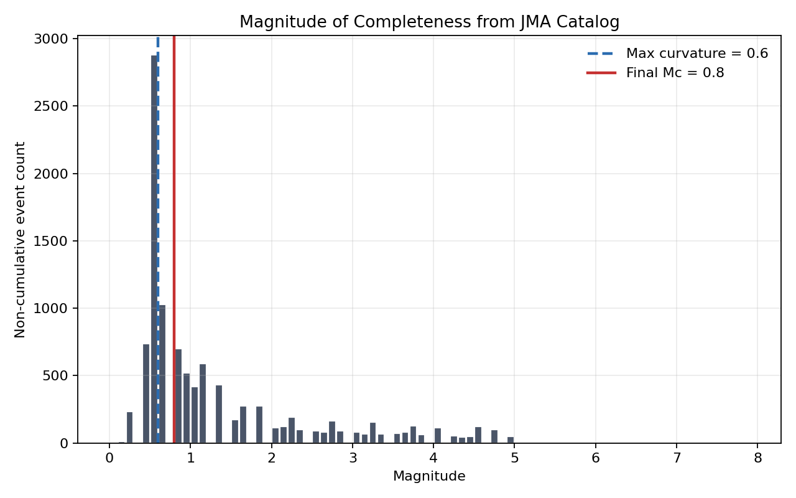
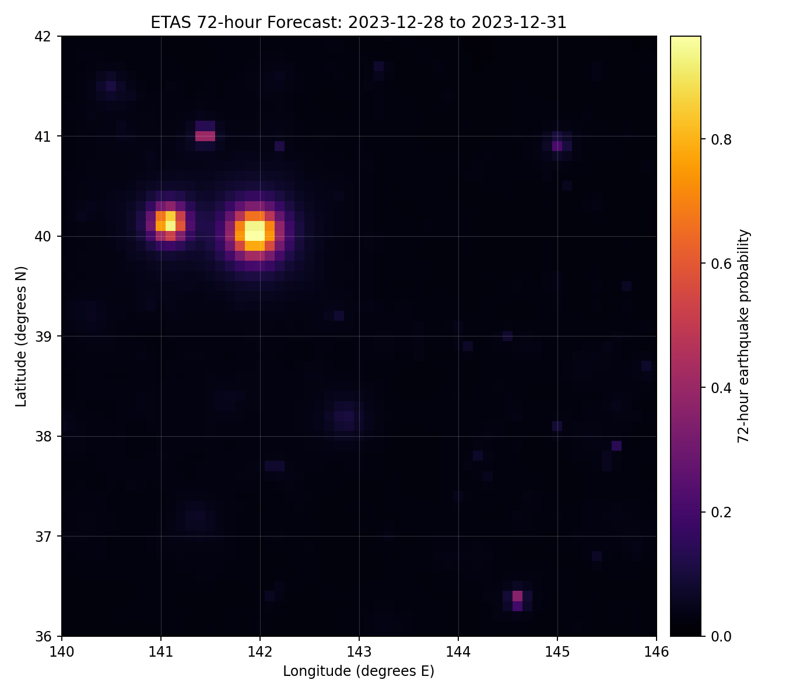
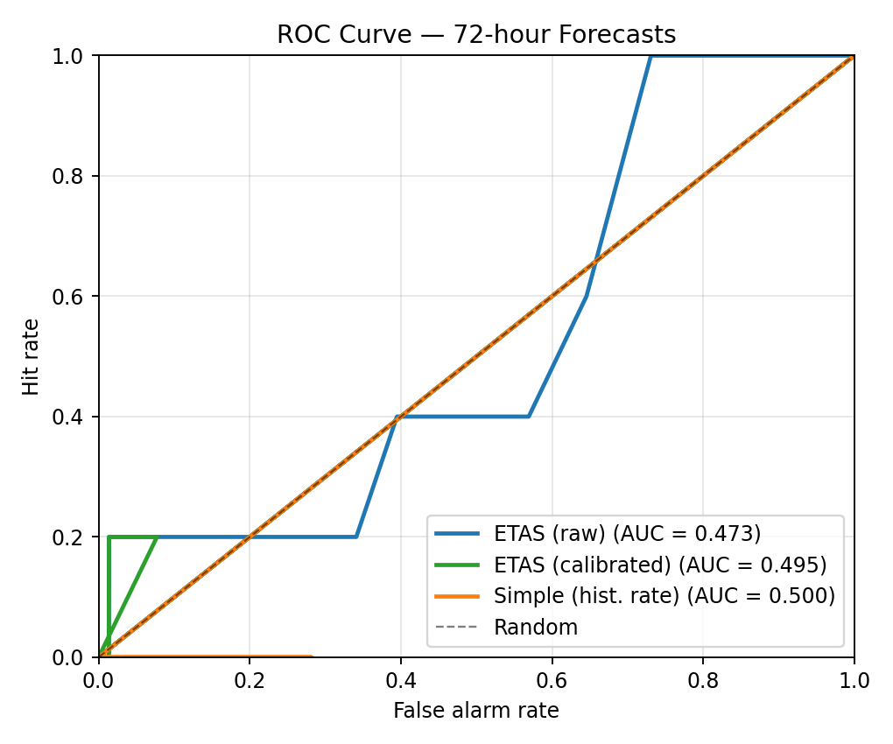
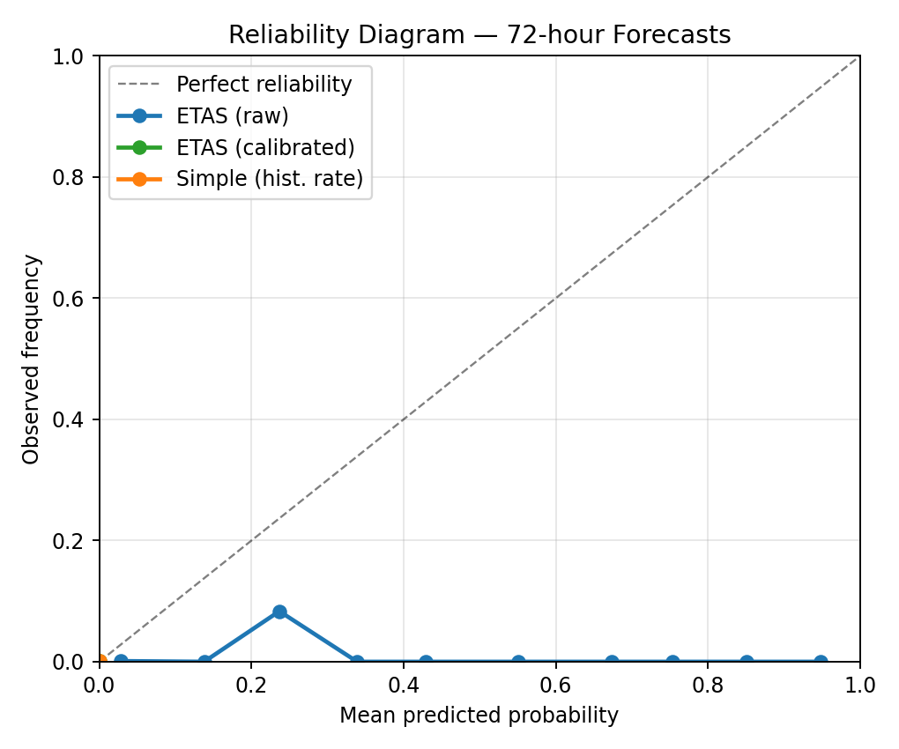
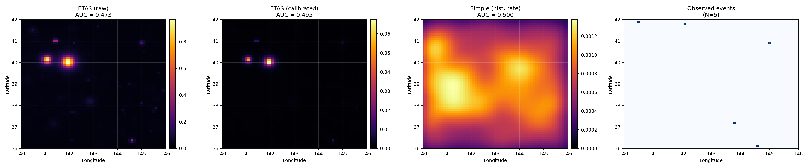

# jma-etas-benchmark

Reproducible **72-hour probabilistic earthquake forecasting** for the offshore Tohoku/Kanto region of Japan using the **ETAS (Epidemic-Type Aftershock Sequence)** model.

Built with the [JMA Unified Hypocenter Catalog](https://www.data.jma.go.jp/svd/eqev/data/bulletin/hypo_e.html) (2010–2023).

---

## What is ETAS? (Simple explanation)

Earthquakes trigger more earthquakes. When a big quake happens, it creates aftershocks. Those aftershocks can trigger their own aftershocks — like a chain reaction.

**ETAS** is a statistical model that learns this triggering behavior from past data. It answers: *"For each 0.1° x 0.1° cell on the map, what is the probability of at least one earthquake in the next 72 hours?"*

The model has two components:
- **Background rate** — spontaneous earthquakes that happen on their own
- **Triggered rate** — aftershocks caused by previous earthquakes, which decay with time and distance

---

## What this project does

```
JMA earthquake catalog (2010-2023)
        │
        ▼
  1. Filter region & time period
        │
        ▼
  2. Estimate magnitude of completeness (Mc)
        │
        ▼
  3. Decluster into mainshocks & aftershocks
        │
        ▼
  4. Fit ETAS model parameters
        │
        ▼
  5. Generate 72-hour probability forecast
        │
        ▼
  6. Calibrate to match observed rate
        │
        ▼
  7. Validate against actual earthquakes
        │
        ▼
  Final output: forecast map + skill scores
```

---

## Pipeline steps and results

### Step 1: Load and filter catalog
Reads the raw JMA CSV, standardises columns, and keeps only events in the target region (36°N–42°N, 140°E–146°E) and period (2010–2023).

```bash
python src/01_load_and_filter.py
```
**Result:** `data/processed/catalog_region_2010_2023.csv` — **10,495 events** filtered to the study region.

---

### Step 2: Estimate magnitude of completeness (Mc)
Finds the smallest magnitude above which all earthquakes are reliably detected using the maximum curvature method + 0.2 conservative offset.

```bash
python src/02_estimate_mc.py
```
**Result:** Mc = **0.8** (max curvature at 0.6). Events below Mc are discarded.

```
Mc_max_curvature=0.6
Mc_conservative=0.8
events_before=10495
events_after=5608
```



---

### Step 3: Declustering (Gardner-Knopoff)
Separates earthquakes into mainshocks (independent) and aftershocks (triggered) using magnitude-dependent time/distance windows.

```bash
python src/03_decluster.py
```
**Result:** **4,682 mainshocks** and **926 aftershocks** identified.

| File | Description |
|------|-------------|
| `data/processed/mainshocks_gk.csv` | Declustered mainshock catalog |
| `data/processed/aftershocks_gk.csv` | Flagged aftershocks |

---

### Step 4: Fit ETAS model
Fits the 8-parameter space-time ETAS model using maximum likelihood estimation (R `ETAS` package).

```bash
Rscript etas/fit_etas.R
```

| Parameter | Description | Fitted value |
|-----------|-------------|-------------|
| mu | Background rate (events/day/deg²) | 0.59 |
| A | Productivity coefficient | 0.20 |
| c | Omori time offset (days) | 0.023 |
| alpha | Magnitude sensitivity | 1.50 |
| p | Omori decay exponent | 1.11 |
| D | Spatial scale (deg²) | 0.0012 |
| q | Spatial decay exponent | 1.86 |
| gamma | Magnitude-dependent spatial scaling | 1.04 |

> **Note:** The CRAN `ETAS` R package may require additional iterations (`ETAS_NO_ITR=300`) for full convergence. The pipeline defaults to 11 iterations as a quick demo.

---

### Step 5: Generate ETAS forecast
Evaluates the fitted ETAS conditional intensity on a 61×61 grid (0.1° resolution) and converts expected counts to Poisson probabilities.

```bash
python src/04_etas_forecast.py
```

**Forecast window:** 2023-12-28 to 2023-12-31 (72 hours)

---

### Step 6: Calibrate forecast
Scales the background rate (mu) so the total expected earthquakes matches the long-term observed rate. This fixes the N-test (number test).

```bash
python src/calibrate_etas.py
```

| Metric | Raw ETAS | Calibrated ETAS |
|--------|----------|----------------|
| mu (background rate) | 0.5900 | **0.0122** |
| Expected events (72h) | 159.43 | **3.29** |

---

### Step 7: Simple historical rate baseline
Creates a simple benchmark forecast using a Gaussian kernel density estimate of past earthquake locations. No temporal triggering — just smoothed historical seismicity.

```bash
python src/07_simple_forecast.py
```

---

### Step 8: Visualize forecast map
Generates the final publication-quality probability map.

```bash
python src/05_visualize.py
```



---

### Step 9: Validate all forecasts
Compares each forecast against the 5 observed earthquakes in the 72-hour window and computes standard seismological skill scores.

```bash
python src/06_validate.py
```

#### Validation results

| Metric | ETAS (raw) | ETAS (calibrated) | Simple baseline | What it means |
|--------|:----------:|:-----------------:|:---------------:|--------------|
| Expected events | 159.43 | **3.29** | 3.01 | Model-predicted count |
| Observed events | 5 | 5 | 5 | What actually happened |
| **N-test** | **FAIL** 🔴 | **PASS** 🟢 | **PASS** 🟢 | Correct total count? |
| Log-likelihood | -175.70 | **-38.96** 🏆 | -40.91 | Higher = better fit |
| ROC AUC | 0.473 | 0.495 | 0.500 | 0.5 = random, 1.0 = perfect |





#### Key takeaways
- The **raw ETAS** overpredicts by 32× (not calibrated for this region)
- The **calibrated ETAS** passes the N-test and has the best log-likelihood
- The **simple baseline** also passes N-test but has lower log-likelihood
- With only 5 events in the window, spatial skill (AUC) is near random for all models — a longer evaluation with many windows is needed

---

## How to run

### Option 1: Docker (recommended — easiest)

```bash
# 1. Get the data
# Download from: https://www.data.jma.go.jp/svd/eqev/data/bulletin/hypo_e.html
# Save as: data/raw/jma_tohoku_2010_2023.csv

# 2. Run everything
docker compose build
docker compose run --rm jma-etas-benchmark

# For a proper scientific ETAS fit (takes longer):
docker compose run --rm -e ETAS_NO_ITR=300 jma-etas-benchmark
```

### Option 2: Manual (Python + R)

**Requirements:**
- Python 3.10+
- R 4.2+ with the `ETAS` package

```bash
# Install Python packages
pip install -r requirements.txt

# Install R package
Rscript -e "install.packages('ETAS', repos='https://cloud.r-project.org')"

# Run the full pipeline
bash run_pipeline.sh
```

### Option 3: Run individual steps

```bash
# Pre-processing
python src/01_load_and_filter.py
python src/02_estimate_mc.py
python src/03_decluster.py

# ETAS fitting and forecasting
Rscript etas/fit_etas.R
python src/04_etas_forecast.py

# Calibration and baseline
python src/calibrate_etas.py
python src/07_simple_forecast.py

# Visualization and validation
python src/05_visualize.py
python src/06_validate.py
```

---

## Project structure

```
jma-etas-benchmark/
├── run_pipeline.sh          # Full pipeline script
├── docker-compose.yml       # Docker configuration
├── Dockerfile               # Container definition
├── requirements.txt         # Python dependencies
├── README.md                # This file
├── METHODS.md               # Detailed methodology
│
├── src/                     # Python scripts
│   ├── 01_load_and_filter.py
│   ├── 02_estimate_mc.py
│   ├── 03_decluster.py
│   ├── 04_etas_forecast.py
│   ├── 05_visualize.py
│   ├── 06_validate.py
│   ├── 07_simple_forecast.py
│   └── calibrate_etas.py
│
├── etas/                    # R scripts
│   ├── fit_etas.R
│   └── generate_forecast.R
│
├── data/
│   ├── raw/                 # Raw JMA data (not committed)
│   ├── processed/           # Cleaned catalogs
│   └── outputs/             # Forecasts, parameters, metrics
│
├── figures/                 # Visualization outputs
└── scripts/                 # Utility scripts
```

---

## Data

The JMA Unified Hypocenter Catalog is available from the Japan Meteorological Agency:
https://www.data.jma.go.jp/svd/eqev/data/bulletin/hypo_e.html

Download the CSV with columns: `Date, Time, Latitude(°N), Longitude(°E), Depth(km), Mag`
Place it at: `data/raw/jma_tohoku_2010_2023.csv`

---

## Citation

```bibtex
@misc{jma-etas-benchmark,
  title = {JMA ETAS Benchmark: Reproducible 72-hour Earthquake Forecasting},
  author = {Bala Chandra Sekhar Reddy Moole},
  year = {2026},
  note = {Open-source reproducible benchmark for ETAS-based earthquake forecasting},
  url = {https://github.com/bala2006/jma-etas-benchmark}
}
```

Also cite the data source:
- Japan Meteorological Agency, Unified Hypocenter Catalog
- Ogata, Y. (1988). Statistical models for earthquake occurrences. *JASA*, 83(401), 9-27.
- Gardner, J.K. & Knopoff, L. (1974). Is the sequence of earthquakes in Southern California, with aftershocks removed, Poissonian? *BSSA*, 64(5), 1363-1367.

---

## Research context

This project is preparatory work for **MEXT graduate research at Kyoto University Disaster Prevention Research Institute (DPRI)**. The goal is to demonstrate reproducible statistical seismology practice before extending to strict temporal validation and machine learning comparisons.
